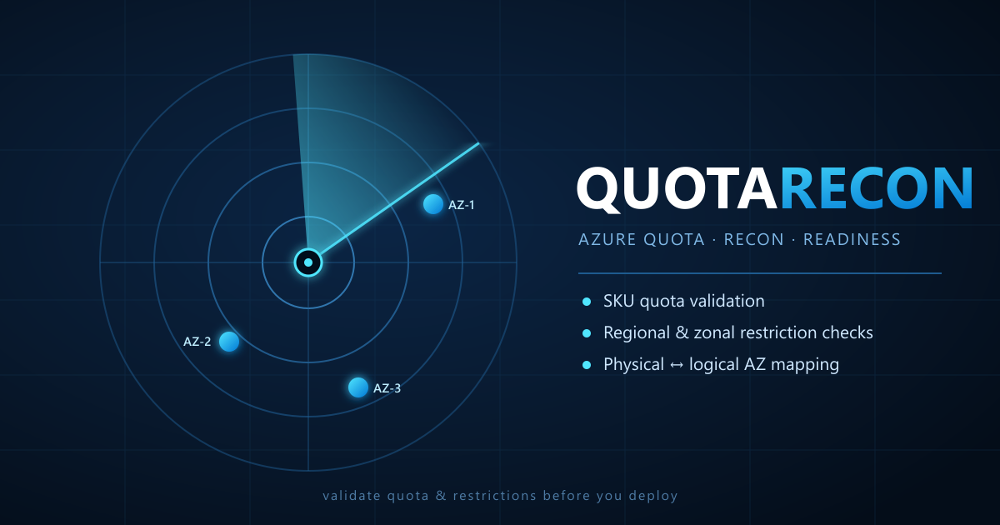

# QuotaRecon



**Reconnaissance for Azure compute quota, SKU restrictions, and availability-zone
mappings across many subscriptions, regions, and SKUs — in one Excel workbook.**

QuotaRecon answers the questions that come up on every capacity call:

1. **Do I actually have quota for `<SKU>` in `<region>` on `<subscription>`?**
   Regional vCPU limit, family vCPU limit, and current usage — all rolled up per
   Sub × Region × SKU.
2. **Is this SKU even offered here, and are any zones restricted?**
   Reads `Microsoft.Compute/skus` and surfaces every `Location`, `Zone`, and
   `NotAvailableForSubscription` restriction with its `ReasonCode`.
3. **Which logical zone (`1`/`2`/`3`) is which physical zone for this
   subscription?**
   Calls `Microsoft.Resources/checkZonePeers` and produces a logical → physical
   zone map per Sub × Region, so you can reason about co-location across
   subscriptions.

Output is a single `.xlsx` with one worksheet per concern plus a rolled-up
`Summary` sheet you can hand to a customer.

---

## Requirements

- **PowerShell 7+** (Windows PowerShell 5.1 also works, but 7 is recommended).
- **Az PowerShell** — at minimum `Az.Accounts`. Sign in once with
  `Connect-AzAccount` before running.
- **ImportExcel** module for the workbook writer:

  ```powershell
  Install-Module ImportExcel -Scope CurrentUser
  ```

- Read access on every subscription in your list (`Reader` is enough).

QuotaRecon deliberately avoids `az rest` / `az.cmd` because those re-parse
arguments through `cmd.exe` and break on `?` in URLs. It uses
`Get-AzAccessToken` + `Invoke-RestMethod` directly.

---

## Quick start

```powershell
# 1. Sign in and pick any subscription in the target tenant.
Connect-AzAccount
Set-AzContext -Subscription <any-sub-in-the-tenant>

# 2. Copy the sub template to a LOCAL copy that git will ignore, and put
#    your real GUIDs there. `*.local.csv` is in .gitignore.
Copy-Item ./templates/subscriptions.csv ./templates/subscriptions.local.csv

# 3. Edit templates/subscriptions.local.csv, templates/regions.csv, and
#    templates/skus.csv to taste. Then run:
./Invoke-QuotaRecon.ps1 `
    -SubscriptionsCsv ./templates/subscriptions.local.csv `
    -RegionsCsv       ./templates/regions.csv `
    -SkusCsv          ./templates/skus.csv
```

You can also pass values inline instead of using the CSVs:

```powershell
./Invoke-QuotaRecon.ps1 `
    -SubscriptionIds '11111111-1111-1111-1111-111111111111','2222...' `
    -Regions         'eastus2','westus3' `
    -Skus            'Ddsv6','Ddsv5','Standard_E8ds_v5'
```

Or omit everything and let the script prompt you interactively.

### Diagnostic mode

Add `-DiagnosticLog` to any invocation to write a full transcript log
(including every ARM URL and any 4xx response body) to
`<OutputPath>.log`. Handy when a customer reports a weird result and you
need a repro trail. Do not use for demos — the log contains subscription
GUIDs.

### Reference data (regions + all VM SKUs)

Under `references/` you'll find two CSVs generated from the live Azure
catalog: `regions-reference.csv` (109 regions with physical-zone mappings)
and `vm-skus-reference.csv` (every VM size with its family and the regions
that offer it). These are **reference only** — the tool never consumes them
as input. Regenerate them with `tools/New-QRReferences.ps1`.

---

## Input formats

All three CSVs are single-column, header-first, comma- or newline-separated.
Blank lines and `#` comments are ignored. Casing and whitespace are normalized.

### `templates/subscriptions.csv`

```csv
SubscriptionId
11111111-1111-1111-1111-111111111111
22222222-2222-2222-2222-222222222222
```

Values must be GUIDs. Anything else is reported in the `Errors` sheet.
**Real GUIDs belong in `subscriptions.local.csv`** — that filename pattern
is in `.gitignore`, so your customer's IDs never end up on GitHub.

### `templates/regions.csv`

Accepts either the ARM name (`eastus2`) or the display name (`East US 2`).
Case and spaces are ignored. Unknown values are reported with the closest
match suggestion. See `references/regions-reference.csv` for every valid
value.

```csv
Region
eastus2
West US 3
southcentralus
```

### `templates/skus.csv`

Accepts any of these forms (all normalize to `Standard_D4s_v5`):

- `Standard_D4s_v5`
- `D4s_v5`
- `D4s v5`
- `D4sv5`

You can also supply a **family** (`Ddsv5`, `Ddsv6`, `Dasv5`, `Lasv4`,
`Easv5`, `Msv2`, ...). QuotaRecon aggregates to family level in the
`Summary` sheet — one row per (Sub × Region × Family) — and auto-picks the
smallest offered size in that family as the "sample" it uses to look up the
region/zone restrictions. If you supply a specific size, that size becomes
the sample. See `references/vm-skus-reference.csv` for every valid family
and size.

```csv
Sku
Ddsv6
Ddsv5
Standard_M128ms
```

---

## Output workbook

| Sheet          | One row per                          | What it tells you                                                         |
| -------------- | ------------------------------------ | ------------------------------------------------------------------------- |
| `Summary`      | Sub × Region × **Family**            | Family quota %, region-wide + per-zone restriction status, physical zones |
| `Quota`        | Sub × Region × quota counter         | Raw `Microsoft.Compute` usage rows (regional vCPU, family vCPU, etc.)     |
| `Restrictions` | Sub × Region × Sample size × restriction | Restriction `Type`, `Locations`, `Zones`, `ReasonCode` (one row each) |
| `ZoneMap`      | Sub × Region × logical zone          | `PhysicalZone` label (e.g. `uksouth-az1`) per sub — from `/locations`     |
| `Inputs`       | Raw input value                      | What you supplied vs what QuotaRecon normalized it to                     |
| `Errors`       | Failure                              | Auth, 4xx, unknown region/SKU, etc. — never fails the whole run           |

The `Summary` sheet uses conditional formatting:

- **`MaxUsagePercent`** — yellow ≥ 80 %, red ≥ 95 %.
- **`Regional-Restrictions`**, **`Logical-AZ1-Restrictions`**,
  **`Logical-AZ2-Restrictions`**, **`Logical-AZ3-Restrictions`** —
  green `None`, red `Yes`.
- **`RestrictionSummary`** is a single string that mirrors what
  `az vm list-skus --location <region> --size <sample>` prints, e.g.
  `NotAvailableForSubscription, type: Zone, locations: eastus2, zones: 3,1,2`.

---

## How QuotaRecon decides things

- **"Do I have quota?"** — For each (Sub × Region × Family) it reads
  `Microsoft.Compute/locations/{region}/usages` and picks the family counter
  matching `FamilyKey` plus the `cores` regional counter. It reports both,
  because either can be the binding constraint.
- **"Is this SKU offered here?"** — Reads
  `Microsoft.Compute/skus?$filter=location eq '{region}'` once per Sub × Region
  and caches. If the sample size isn't in the list at all, the
  `Regional-Restrictions` column reads `Yes` with reason
  `Sample size 'X' not offered in <region>`.
- **"Which zones?"** — The `Microsoft.Compute/skus` response includes
  `locationInfo[].zones` and a `restrictions[]` array. A `Zone`-type
  restriction flags the specific logical zones in
  `Logical-AZn-Restrictions`. A `Location`-type restriction is region-wide
  and flags `Regional-Restrictions = Yes` AND all three logical zones.
- **"Logical → physical zones?"** — Calls
  `GET /subscriptions/{sub}/locations?api-version=2022-12-01` and reads the
  `availabilityZoneMappings` array on each region entry, which gives the
  logical → physical mapping (e.g. `1 → uksouth-az3`) directly per
  subscription. No peer subscription required. Two subscriptions in the same
  tenant whose logical `1` maps to the same `<region>-azN` string are
  co-located.

---

## Repo layout

```
QuotaRecon/
├── Invoke-QuotaRecon.ps1             # entry point
├── src/
│   ├── QuotaRecon.Auth.ps1           # Get-AzAccessToken wrapper + Invoke-QRArm
│   ├── QuotaRecon.Input.ps1          # normalization (regions, SKUs, subs, names)
│   ├── QuotaRecon.Quota.ps1          # usages calls + family matching
│   ├── QuotaRecon.Skus.ps1           # resourceSkus + restriction flattening
│   ├── QuotaRecon.Zones.ps1          # /locations availabilityZoneMappings
│   └── QuotaRecon.Excel.ps1          # ImportExcel writer + conditional formatting
├── templates/
│   ├── subscriptions.csv             # empty template (safe to publish)
│   └── subscriptions.local.csv       # your real GUIDs — gitignored
│   ├── regions.csv
│   └── skus.csv
├── references/
│   ├── regions-reference.csv         # every Azure region + physical zone map
│   └── vm-skus-reference.csv         # every VM size + regions offered
├── tools/
│   ├── Test-Syntax.ps1               # parse every ps1 as a smoke test
│   ├── New-QRReferences.ps1          # regenerate the references/ CSVs
│   └── Debug-SubName.ps1             # diagnose sub-name resolution issues
├── graphics/                         # README banner + screenshots
├── output/                           # workbooks and diagnostic logs (gitignored)
├── LICENSE
└── README.md
```

---

## Roadmap

- v0.1 — this release: quota + restrictions + zone map in a single XLSX,
  family aggregation, physical-zone mapping via `/locations`, `-DiagnosticLog`
  transcript, and reference CSVs.
- v0.2 — parallelize per-subscription with `ForEach-Object -Parallel`.
- v0.3 — network / storage quota (currently compute only).
- v0.4 — HTML report alongside the XLSX for easier customer share-outs.

---

## Contributing / feedback

QuotaRecon is intended to be handed to customers and other Microsoft CSAs, so
correctness matters more than cleverness. Bug reports and PRs welcome —
especially edge cases in SKU naming, family-vCPU counters, and non-standard
regions.
